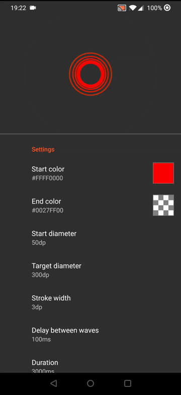

# CircleWaveView
Custom view showing circles expanding from the center like waves



# Usage

To use this library just include it in your dependencies using

```groovy
    repositories {
        ...
        maven { url "https://jitpack.io" }
    }
```
    
in your project build.gradle file and

```groovy
    dependencies {
        compile 'com.github.markusressel:CircleWaveView:v1.0.1'
    }
```
    
in your desired module build.gradle file.

Then include it in one of your layout files like so:

```xml
<de.markusressel.android.library.circlewaveview.CircleWaveView
        android:id="@+id/circleWaveView"
        android:layout_width="match_parent"
        android:layout_height="match_parent" />
```

# Customization

You can customize the look and feel of this view very easily through either xml attributes:

```xml
<de.markusressel.android.library.circlewaveview.CircleWaveView
        android:id="@+id/circleWaveView"
        android:layout_width="match_parent"
        android:layout_height="0dp"
        android:layout_weight="1"
        app:cwav_delayMillisecondsBetweenWaves="300"
        app:cwav_durationMilliseconds="3000"
        app:cwav_endColor="#0000FFFF"
        app:cwav_startColor="?attr/colorAccent"
        app:cwav_startDiameter="0dp"
        app:cwav_strokeWidth="3"
        app:cwav_targetDiameter="100dp"
        app:cwav_waveCount="3" />
```

or using code:

```kotlin
circleWaveView.startColor = startColor
circleWaveView.endColor = endColor
circleWaveView.startDiameter = pxFromDp(this, startDiameter)
circleWaveView.endDiameter = pxFromDp(this, targetDiameter)
circleWaveView.strokeWidth = pxFromDp(this, strokeWidth)
circleWaveView.delayBetweenWaves = delayBetweenWaves
circleWaveView.duration = duration
circleWaveView.waveCount = waveCount
circleWaveView.interpolator = FastOutSlowInInterpolator()
```

You can find more detailed descriptions in the javadoc of each method.


# License

    Copyright (c) 2016 Markus Ressel
    
    Licensed under the Apache License, Version 2.0 (the "License");
    you may not use this file except in compliance with the License.
    You may obtain a copy of the License at
    
    http://www.apache.org/licenses/LICENSE-2.0
    
    Unless required by applicable law or agreed to in writing, software
    distributed under the License is distributed on an "AS IS" BASIS,
    WITHOUT WARRANTIES OR CONDITIONS OF ANY KIND, either express or implied.
    See the License for the specific language governing permissions and
    limitations under the License.
